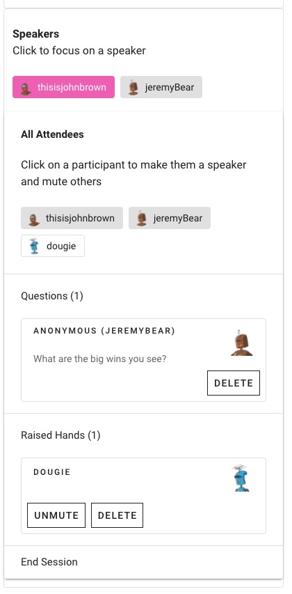
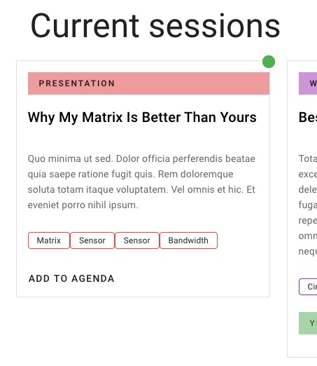

# unconference
## A new take on conferences during remote times

This is a project for the [#HackingFromHome Hackathon](https://mattermost.com/hackfest2020/).

This project is inspired by the unconferences of the past, in the before times, when we could gather together to learn from each other and share ideas. That has become so hard during the Covid-19 moment we're living through, because there aren't many directly interactive spaces for this sort of conversation.

This is the frontend website portion of the project. It will be hosted at [unconference.dev](https://unconference.dev).


## Technologies

Made with [VueJS](https://vuejs.org/) and [Vuetify](https://vuetifyjs.com/) frontend, a [Firestore](https://firebase.google.com/products/firestore) backend, and [Vuexfire](https://vuefire.vuejs.org/vuexfire/) for binding it all together.

Please combine with [this forked version of jitsi-meet](https://github.com/thisisJohnBrown/jitsi-meet), in order to get the added features and functionality of syncing views between participants.

## Config files

You will need a `firebase.config.js` file in order to run this project. This can be retrieved from the Firebase admin.

## Setup - Vue CLI
```
yarn install
```

### Compiles and hot-reloads for development
```
yarn serve
```

### Compiles and minifies for production
```
yarn build
```

### Lints and fixes files
```
yarn lint
```

# Usage

Here's a [demo video](https://www.dropbox.com/s/1nst9b240bkpb8z/demo1.mov?dl=0) showing you a moderated panel, syncing up Jitsi streams.

## UI



